# Azure File Ingestion (APIM + Functions + Blob + Queue + Cosmos)

Production-style file ingestion flow using Azure services and CI/CD.

- API behind APIM
- HTTP-triggered Function for upload
- Blob Storage for raw files
- Queue-based processing
- Cosmos DB for metadata
- GitHub Actions for deployment
- Infra created manually with least privilege

All code is in this repo. Infra proof is in screenshots and policy files.

---

## What this does

End-to-end flow:

1. Client calls `POST /File/upload` on the Web API (behind APIM).
2. API forwards the file to `BlobUpload` Azure Function.
3. `BlobUpload`:
   - Validates headers
   - Uploads PDF into `uploads` container
   - Sets metadata
4. Blob events are sent into `blob-events` queue.
5. `CosmosPersist` Function (queue trigger):
   - Reads queue message
   - Resolves blob and metadata
   - Writes an `IngestedFile` document into Cosmos DB
     - Partition key: `/contact`

Goal: model a realistic Azure ingestion pipeline, not a demo controller.

---

## Architecture

**Components**

- API:
  - ASP.NET Web API (`FileController`)
  - Exposed via APIM
  - Forwards uploads to Function with function key

- Azure Functions (isolated worker):
  - `BlobUpload`
    - HTTP trigger
    - Uses `BlobContainerClient`
    - Uploads with metadata
  - `CosmosPersist`
    - Queue trigger on `blob-events`
    - Uses `BlobServiceClient` + `CosmosClient`
    - `UpsertItemAsync` into Cosmos

- Storage:
  - Blob Storage
    - Container: `uploads`
  - Queue Storage / Event Grid
    - Queue: `blob-events` for processing trigger

- Database:
  - Cosmos DB
    - Database: `fileingest` (default)
    - Container: `uploads`
    - Partition key: `/contact`
    - Model: `IngestedFile`

- API Management:
  - Azure API Management in front of the Web API
  - Product + subscription key
  - Policies from `APIMpolicies.txt`

- Hosting:
  - App Service for Web API
  - Azure Functions (flex/consumption) for functions

---

### Flow diagram

```mermaid
flowchart LR
    subgraph ClientSide["Client"]
        U["Consumer / Internal App"]
    end

    subgraph Edge["API Exposure"]
        A["Azure API Management\n(Policies, Subscription, Validation)"]
    end

    subgraph AppTier["App Service"]
        W["Web API (ASP.NET Core)"]
    end

    subgraph IngestFunc["Upload Function App"]
        F1["BlobUpload Function\n(HTTP Trigger)"]
    end

    subgraph Storage["Storage Account"]
        B["Blob Container: uploads/"]
        Q["Queue: blob-events"]
    end

    subgraph ProcessFunc["Processor Function App"]
        F2["CosmosPersist Function\n(Queue Trigger)"]
    end

    subgraph Data["Cosmos DB"]
        C["DB: fileingest\nContainer: uploads\nPK: /contact"]
    end

    U --> A
    A --> W
    W --> F1
    F1 -->|"Upload PDF + metadata\n(fileName, contact)"| B
    B -->|"Event Grid / binding\ncreates queue message"| Q
    Q --> F2
    F2 -->|"Upsert IngestedFile"| C

```

## APIM configuration

Policies stored as code in `APIMpolicies.txt`.

APIM is updated via CI/CD using the OpenAPI definition from the API. Each deploy creates a new API revision.

## CI/CD

Workflows live under `.github/workflows`.

## Infra notes

- All Azure resources were created manually:
  - Cheapest tiers available to keep costs down
  - Roles assigned with least privilege in mind
- App Service inbound locked:
  - Only APIM allowed
- APIM:
  - Product and subscription configured
  - Tested using Postman
- Storage:
  - Blob container for uploads
  - Queue/Event Grid wiring for `blob-events`
- Cosmos:
  - Account + DB + container created and wired
 
For more info see `azurenotes.txt`.

Infra has been deleted to avoid costs.
Evidence and configuration snapshots are stored under `azure project prints` and referenced by `prints.md`.
